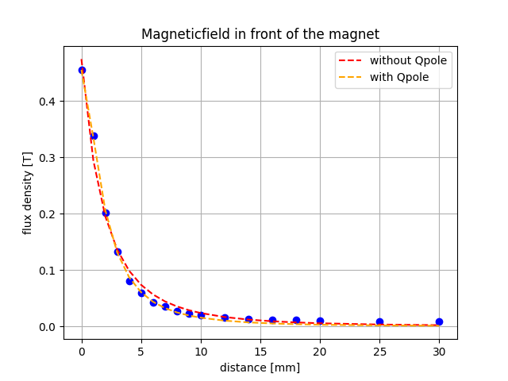

# Fit Cube
## Result

Both lines are exactly on top of each other

Magnetic Moment of Cube
    m:   4.6611e+08 +/- 69118280.5 (14.83%)
    r0: -5.81380565 +/- 0.31609683 (5.44%)
## Report
```
[[Model]]
    Model(Bx_dp)
[[Fit Statistics]]
    # fitting method   = leastsq
    # function evals   = 62
    # data points      = 18
    # variables        = 2
    chi-square         = 0.00334912
    reduced chi-square = 2.0932e-04
    Akaike info crit   = -150.609743
    Bayesian info crit = -148.828999
    R-squared          = 0.98764864
[[Variables]]
    m:   4.6611e+08 +/- 69118280.5 (14.83%) (init = 4.6611e+08)
    r0: -5.81380565 +/- 0.31609683 (5.44%) (init = -0.05)
[[Correlations]] (unreported correlations are < 0.100)
    C(m, r0) = -0.988
```


## Cylinder
```
[[Model]]
    Model(Bx_dp)
[[Fit Statistics]]
    # fitting method   = leastsq
    # function evals   = 62
    # data points      = 18
    # variables        = 2
    chi-square         = 0.00372050
    reduced chi-square = 2.3253e-04
    Akaike info crit   = -148.716832
    Bayesian info crit = -146.936089
    R-squared          = 0.98216389
[[Variables]]
    m:   6.9439e+08 +/- 1.1934e+08 (17.19%) (init = 4.6611e+08)
    r0: -6.99293535 +/- 0.44472250 (6.36%) (init = -0.05)
[[Correlations]] (unreported correlations are < 0.100)
    C(m, r0) = -0.988
```
## TO DO
- [ ] Use errorbars
- [ ] Compare values to see if they are reasonable